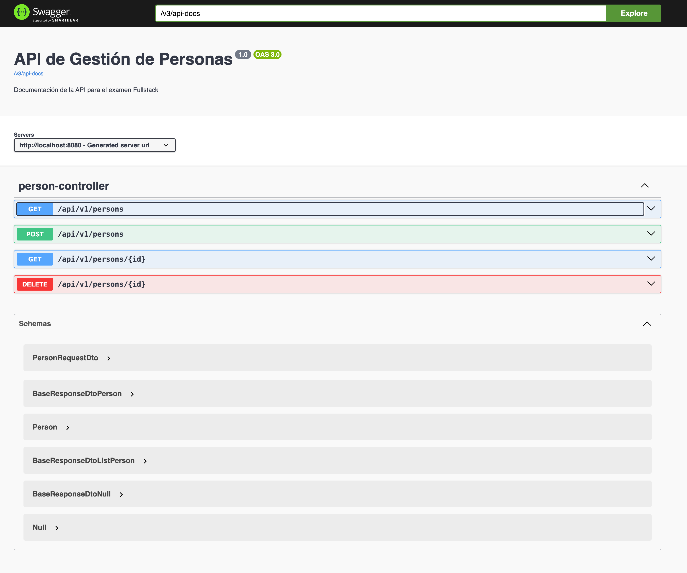
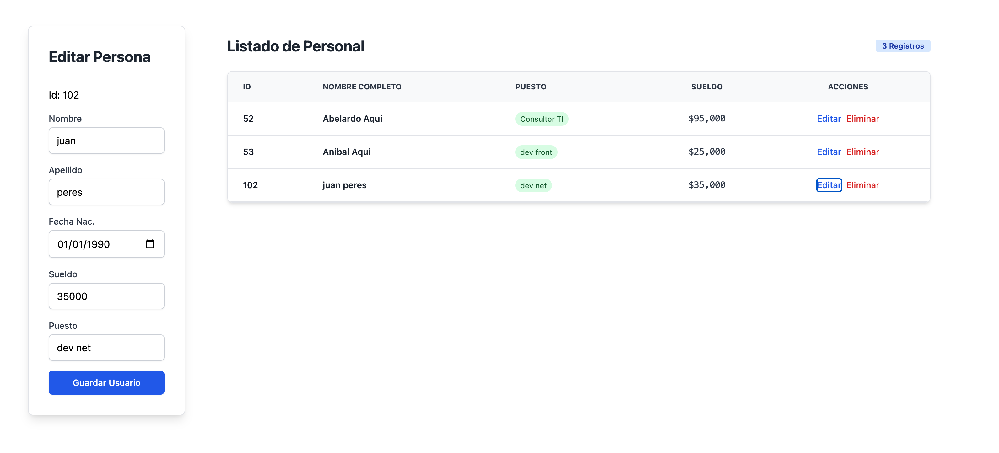

# Proyecto de Gestión de Personal - Fullstack



Este proyecto es una aplicación Fullstack desarrollada como parte de un examen técnico. Consta de un backend robusto construido con Spring Boot y un frontend moderno y reactivo desarrollado con React + Vite.

## 🛠️ Prerrequisitos

Para ejecutar este proyecto de manera local, asegúrate de cumplir con las siguientes versiones de software:

* **Java**: Versión 25 (con Maven configurado).
* **Node.js**: Versión 24.x o superior.
* **MySQL**: Instancia activa en el puerto 3306.

---

## 🚀 Configuración y Ejecución

### 1. Base de Datos
Antes de iniciar el backend, es necesario preparar la base de datos MySQL.
1. Abre tu gestor de base de datos preferido.
2. Ejecuta el script de inicialización ubicado en la carpeta:
   `scripts/init.sql` (o el nombre exacto de tu archivo de script).

### 2. Backend (Spring Boot)
Desde la raíz de la carpeta del backend, ejecuta:

```bash
./mvnw spring-boot:run
```

---

###  Instalación de dependencias
```
npm install
```

### Ejecución en modo desarrollo
```
npm run dev
```

## 📦 Tecnologías Utilizadas
Backend: Java 25, Spring Boot 4.0.5, Spring Data JPA, Hibernate Validator, MySQL.

Frontend: React, Vite, Axios, Tailwind CSS.

Documentación: SpringDoc OpenAPI (Swagger).
